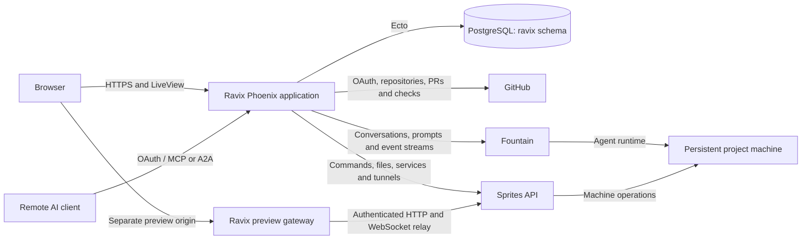
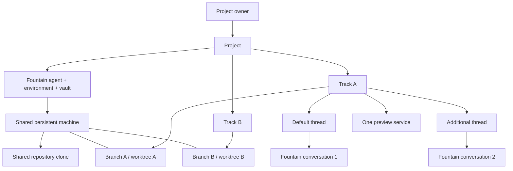
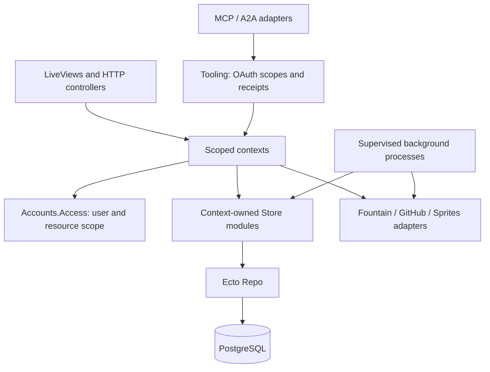
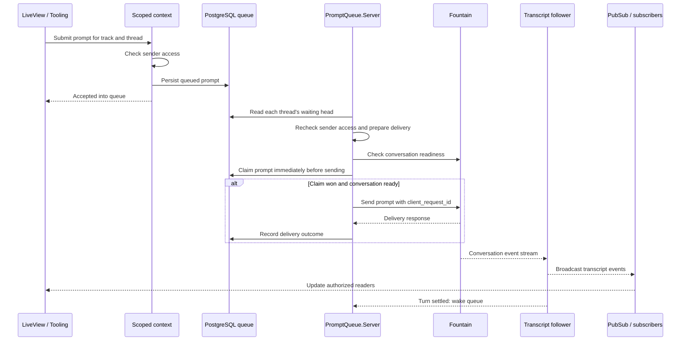
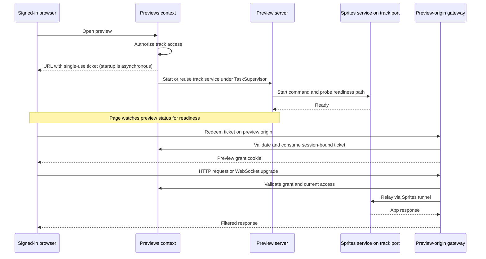
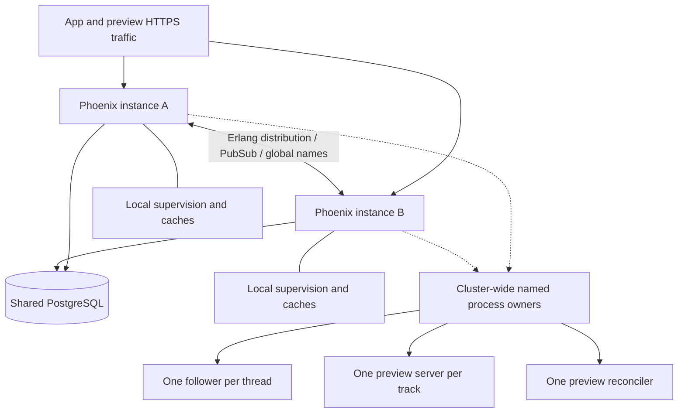

# Ravix architecture

Ravix is a Phoenix/LiveView application that turns repositories into shared
projects and tracks of agent work. Fountain runs the agent conversations;
Sprites provides the persistent machines. Ravix owns access, coordination,
and the browser workspace.

This guide describes the implementation at `75500ff` (2026-09-25), including
the staged threads rollout. It is a source-code map, not a claim about which
flags are enabled in production. Diagrams use Mermaid and render on GitHub.

- [System boundaries](#system-boundaries)
- [Projects, tracks, and threads](#projects-tracks-and-threads)
- [Application and access boundaries](#application-and-access-boundaries)
- [Prompt delivery and transcripts](#prompt-delivery-and-transcripts)
- [Private previews](#private-previews)
- [Deployment and recovery](#deployment-and-recovery)
- [Decisions and proposed changes](#decisions-and-proposed-changes)

## System boundaries

Arrows describe communication, not ownership of the destination.

The gateway is part of the same Phoenix application and HTTP listener. Its
separate box shows the preview origin and authorization boundary. Browser
hooks own local interaction such as drafts, scrolling, and terminal history;
contexts own business state. Bun runs development mocks and tests, not the
production application.

| Authority | State it owns |
| --- | --- |
| Ravix / PostgreSQL | Users, sessions, memberships, project and track identity, threads, plans, queued prompts, preview configuration and grants, tooling receipts |
| Fountain | Agent configuration, environments, vaults, credential sets, conversations, turns and event history |
| GitHub | Repositories, branches on the remote, issues, pull requests and checks |
| Project machine | Working files, local branches/worktrees, running commands and preview services |
| Ravix processes | Live subscriptions, transient caches and coordination; these are not durable records |

Source: [application startup](../lib/ravix/application.ex),
[provider configuration](../lib/ravix/providers.ex),
[Fountain adapter](../lib/ravix/fountain.ex),
[Sprites adapter](../lib/ravix/sprites.ex), and
[HTTP endpoint](../lib/ravix_web/endpoint.ex).

## Projects, tracks, and threads

The current machine boundary is the project. A track owns a branch and
worktree on that shared machine; a thread owns a conversation within the track.

The default thread ID equals the track ID. Additional threads have independent
conversations, transcripts, prompt queues, read markers, drafts and preview
helper grants. They share the track's membership, branch, directory, sandbox
and preview service. Creating another thread does not isolate its file writes.
Closing a track cancels its queued prompts and terminates all its conversations.

`RAVIX_THREADS_ENABLED` controls adding threads. The rollout requires draining
old web instances and queue workers before activation; disabling the button
does not make an old worker safe to run again. Compatibility fields such as
`tracks.conversation_id` still exist during the expand/contract transition.
See [threads rollout](../THREADS_ROLLOUT.md) for the operational sequence.

Project membership grants access across the project; a track invitation grants
only that track. Threads inherit that track boundary. Plans belong to projects;
track guests see only the items assigned to their track, not the whole plan.
Agent work spends the **project owner's** connected subscription regardless of
who submits the prompt. Ravix stores the credential-set identity; the provider
credential itself is written to Fountain through `Accounts.Inference`.

Source: [project schema](../lib/ravix/projects/project.ex),
[track schema](../lib/ravix/tracks/track.ex),
[thread schema](../lib/ravix/tracks/thread.ex),
[access](../lib/ravix/accounts/access.ex),
[plans](../lib/ravix/plans.ex), and
[inference credentials](../lib/ravix/accounts/inference.ex).

## Application and access boundaries

This is a dependency map: a context establishes access before reading or
mutating protected rows. `WorkspaceLive` owns navigation and project forms;
nested `TrackLive` owns the selected track. MCP and A2A share scoped operations
through `Ravix.Tooling`; they do not provide a second unchecked data API.

User-facing operations take the current user. Row access without a user belongs
in a context's `Store`; web code may not name a Store. Cross-context Store or
Repo access requires an `# ownership:` comment identifying the authorization
already established. `Previews.Lifecycle` follows the same rule for id-only
process orchestration. The custom Credo check enforces these dependencies.

Authorization remains live after mount: connected events, messages, URL
patches, async results and stream consumers must respect session expiry and
membership removal. A shared transcript follower does not authorize its
subscribers; the consumer must recheck access and unsubscribe on revocation.

Source: [contributor contract](../AGENTS.md),
[architecture check](../credo/checks/architecture.ex),
[LiveView guard](../lib/ravix_web/live/guard.ex),
[Tooling](../lib/ravix/tooling.ex), and
[remote client documentation](agent-tooling.md).

## Prompt delivery and transcripts

Saving a prompt and completing an agent turn are separate events. Delivery
continues without an open browser.

Queue workers run on every application instance. Database claims decide which
worker sends a row; work across threads can advance independently. A failed or
unconfirmed head blocks later prompts in that thread. The machine's execution
scheduling is separate from this queue concurrency.

An ambiguous send is retained as `unconfirmed`, never blindly replayed.
Recovery looks for the prompt's `client_request_id` in Fountain's turns. That
value correlates a turn with a prompt; it is **not** a provider idempotency key.
If no matching turn is found, the prompt still needs a person's decision.

The initial transcript comes from Fountain's paged feed. A cluster-wide
follower streams subsequent events once per thread and fans them out over
PubSub. Some follower names and comments still say `track_id`; `Tracks.follow/3`
passes the thread ID. Readers monitor the follower and retain their cursor so
they can resubscribe after its process or node exits.

Source: [submission and follow](../lib/ravix/tracks.ex),
[queue worker](../lib/ravix/prompt_queue/server.ex),
[queue claims](../lib/ravix/prompt_queue/store.ex), and
[follower](../lib/ravix/tracks/follower.ex).

## Private previews

Preview control and browser access use different grants. An agent's helper can
operate its track's preview, but cannot mint browser tickets or change project
defaults.

The gateway runs before static files and normal session handling. App session
cookies are scrubbed from relayed traffic. Tickets last one minute and can be
used once; browser grants last twelve hours and are tied to the signed-in
session. Membership removal revokes access.

The page refreshes a ninety-second viewer lease. After five minutes without
activity, the service stops. Failed startup requires an explicit open or
restart rather than endless automatic retries. Track closure and project
rebuild/archive retire preview services; failed cleanup is persisted for retry.
Commands must use the reserved `$PORT`, bind to `127.0.0.1` and refuse port
fallback. Preview state and ports belong to the track, even with many threads.

Source: [preview context](../lib/ravix/previews.ex),
[preview server](../lib/ravix/previews/server.ex),
[browser grants](../lib/ravix/previews/grant.ex),
[agent helper](../lib/ravix/previews/agent.ex), and
[gateway](../lib/ravix_web/preview_gateway.ex).

## Deployment and recovery

The Render Blueprint configures two instances in one region and one shared
PostgreSQL database. Both application and wildcard preview traffic reach the
same service. This diagram describes configured topology, not a live inventory.

| Work | Placement and recovery |
| --- | --- |
| Transcript follower | `:global` name per thread; local DynamicSupervisor. Surviving readers monitor and resubscribe with their event cursor. |
| Preview server | `:global` name per track serializes lifecycle operations. Durable preview rows let the reconciler restore desired state. |
| Preview reconciler | `Cluster.Singleton` elects one owner while watchers run on each instance. |
| Prompt queue sweep | Runs per instance; claims and idempotent sweep logic coordinate delivery. |
| Caches, Presence, TaskSupervisor, Endpoint | Started locally on each instance; caches are disposable and tasks remain supervised. |

`:global` releases names when their node leaves; it does not move process state
to another node. Durable state belongs in PostgreSQL or the providers.
`/readyz` checks the database before traffic admission; it deliberately does not
require another cluster member. Migrations execute while the old release still
serves, so schema changes must expand before use and contract only after old
readers are gone. Ecto owns the `ravix` schema; legacy `public` tables are
preserved, not imported or dropped.

Source: [Render Blueprint](../render.yaml),
[supervision tree](../lib/ravix/application.ex),
[cluster names](../lib/ravix/cluster.ex),
[singleton ownership](../lib/ravix/cluster/singleton.ex), and
[ADR 0003](../decisions/0003-cluster-and-transparent-deploys.md).

## Decisions and proposed changes

- [ADR 0002](../decisions/0002-elixir-and-liveview.md): Phoenix/LiveView replaces
  the historical Bun/React application. Current code and the contributor
  contract supersede old references to adjacent `_unsafe_` functions.
- [ADR 0005](../decisions/0005-each-person-brings-their-own-agent.md): each
  person connects credentials; projects spend their owner's subscription.
- [ADR 0006](../decisions/0006-a-sandbox-per-track.md) proposes a dedicated
  sandbox and ordinary clone per track. **Not the current topology** shown here.
- [ADR 0007](../decisions/0007-agents-use-ravix-tooling.md) proposes delegated
  tooling access for in-machine agents. Interactive remote MCP/A2A access is
  implemented; the proposed automatic delegation boundary is not.

Native previews/Mac runners and the shared browser remain deferred. Historical
feature briefs under `docs/` are not implementation maps. When changing a
boundary, update the relevant diagram and source links here; keep decision
rationale in [the ADR index](../decisions/index.md) and operational thread
migration steps in [the rollout guide](../THREADS_ROLLOUT.md).
