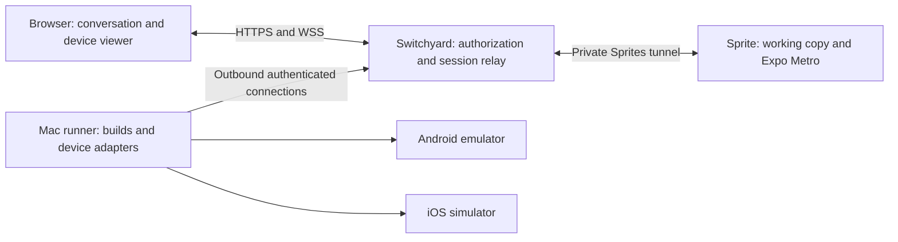

# Native preview runners

Audience: product and engineering; implementation handoff for a coding agent.\
Status: implementation plan; native preview implementation has not started.\
Date: September 5, 2026.\
Code baseline reviewed: `65ef3c7`.

## Outcome and agreed direction

Make an Expo app on a Switchyard track usable as a real Android or iOS app
entirely through the browser. A person asks the agent to change a screen, opens
the device preview, interacts with the result, and requests a correction from
the same conversation. Uncommitted working-copy changes are part of this loop.

The user's Mac workstation will host both the Android emulator and the iOS
simulator. Implement Android with an Expo development build first, then iOS on
the same runner. The Sprite remains the authoritative source workspace and
runs Expo/Metro. Switchyard owns authorization, scheduling, and browser access.

Browser use is the baseline: normal development and preview operations must
work without a native Switchyard client, locally installed viewer, or desktop
interaction on the runner. One-time runner and SDK provisioning happens on the
Mac. Native clients and cloud runners are later extensions of the session
contract. Desktop app previews are also later work.

This document plans implementation. It does not initiate installation, app
builds, runner registration, cloud provisioning, or deployment.

## Evidence and assumptions

- Existing web previews and conversation helpers are deployed and verified.
  They manage one HTTP service per track, with private routing, access
  revocation, readiness, and idle cleanup. See [web preview behavior](../README.md#track-previews).
- A read-only probe of the existing Demos Sprite found Linux `x86_64`, no
  `/dev/kvm`, and no exposed `vmx`/`svm` CPU flags. That workspace lacks the
  acceleration needed for the intended responsive Android preview. This is an
  observation about our current workspace, not a guarantee about every future
  Sprites offering. [Android acceleration](https://developer.android.com/studio/run/emulator-acceleration)
- Expo development builds support custom native dependencies. JavaScript edits
  can use the development server; changes to native dependencies/configuration
  require another native build. [Expo development builds](https://docs.expo.dev/develop/development-builds/introduction/)
- The exact Mac, its CPU architecture, available memory, OS, installed SDKs,
  and network conditions have not been inspected for this project. Confirm
  these during implementation; do not assume the Mac hosting this checkout is
  the intended runner.

The implementation defaults below are proposals, rather than measured capacity
or capabilities already demonstrated on that Mac.

## Architecture

| Component | Responsibility |
| --- | --- |
| Sprite | Agent edits, authoritative worktree, Metro, supporting app services, source export |
| Switchyard | Track access, runner pairing, target configuration, jobs and leases, private tunnel and stream relay |
| Mac runner | Receive assigned jobs, stage source, build native artifacts, own simulator instances, translate input, produce screen and log streams |
| Browser | Choose a platform, view the session, send input, read progress/logs, return to the conversation |

Use one runner process with Android and iOS adapters. It reports the platforms,
runtime versions, architectures, device profiles, codecs, and controls it
actually supports. Device IDs and local paths stay behind the runner API.

Proposed first capacity: one active device session and one native build at a
time on the workstation. Persist a queue with visible position and cancellation.
Android and iOS can be used sequentially. Increase capacity only after measuring
the Mac; support configured limits in the protocol from the beginning.

## Pairing and connection

The project owner enables a runner for selected projects using a short-lived,
single-use pairing code generated in Switchyard. Pairing establishes a
revocable runner identity. Keep the runner credential in its private state
directory; Switchyard stores a verifier, and browsers and agents never receive
that credential. Registration and project assignment are owner operations.

The runner initiates TLS connections to Switchyard, so the workstation needs no
public inbound listener or router port forwarding. Use a versioned WSS control
connection, and separately authorized data channels for video, Metro traffic,
and source/artifact transfer. Large transfers must not delay input, cancellation,
or heartbeat messages. Check origins on browser upgrades and authorize channels
against a specific live session and runner assignment.

Every job carries a job ID, session ID, generation, operation, deadline, and
bounded parameters. Acknowledgements distinguish accepted work from completed
work. Reconnection reports owned jobs and devices; the server reconciles them
against persisted intent. Reject commands and completions from a superseded
runner connection or session generation. Never replay stale input after a
disconnect.

The workstation is a trusted project runner. Native builds execute project
dependency and build scripts. Use a dedicated macOS account and runner-owned
directories without the user's personal credentials; directory confinement is
not an OS sandbox for those scripts. Enable only projects the owner trusts to
execute there. Do not expose a general shell or arbitrary host/port forwarding
API to the browser or conversation helper.

## Expo, source transfer, and builds

### Keep the development server private

Start managed Metro in the selected track directory on a reserved Sprite port,
with explicit development-client mode and a verified host/port configuration.
Allocate ports alongside existing web previews; Android and iOS for the same
track can share Metro. Starting a device must not replace that track's web
preview configuration.

The runner exposes a session-owned loopback forward on the Mac. Its traffic
travels through an authorized Switchyard channel to that track's Metro port
over the existing Sprites transport. Android reaches the forward using a mapping
for its assigned emulator; iOS uses the simulator's host connection. Verify
these addresses on the actual runtimes. [Android emulator networking](https://developer.android.com/studio/run/emulator-networking)

Native clients do not inherit Switchyard's browser cookie. The runner's session
channel supplies authorization, without embedding a credential in the app,
development URL, or manifest. Resolve forwarding destinations server-side.
Bind forwards to loopback, map only the assigned device, and keep ADB and
simulator control services private. Local processes on the trusted workstation
can also reach loopback sockets; this is not isolation from other Mac users.

Prove the manifest, bundle, asset, source-map, reload, and HMR WebSocket paths.
Expo can advertise a proxy URL; the selected CLI version must advertise an
address reachable by the device rather than the Sprite's localhost. Prefer a
common per-track forwarded port on the Mac and devices; serialize or reconfigure
the advertised address if concurrent runners require different addresses.
Pin the working CLI behavior after the first experiment. Do not use a public
Expo tunnel as the production authentication mechanism. [Expo server URLs](https://docs.expo.dev/more/expo-cli/#server-url)

Supporting backend services need explicit named forwards or authenticated app
URLs as well. The first fixture should exercise one track-local API request so
that a working Metro connection does not hide a broken app-backend connection.

### Build the working copy

For the first implementation, build both native targets on the Mac, using its
Android and Xcode toolchains. This gives both adapters the same build-job and
source-transfer path. Android builds can move to Linux/Sprites separately later.

Export a consistent snapshot of the track's required source, including tracked
edits, deletions, and eligible untracked files. Preserve monorepo/workspace
dependencies. Do not require a commit or push. Use a manifest and content hashes;
detect files changing during export and retry rather than silently presenting a
mixed snapshot as consistent.

Exclude Git internals, installed dependencies, caches, build output, and private
agent/runner credentials. Handle required ignored inputs and build environment
values through explicit project configuration, with errors for missing inputs.
Bound archive size and extraction; reject traversal and escaping links. Install
dependencies from the lockfile on the Mac rather than copying Linux binaries.
Each build runs in a runner-owned directory for its project, track, and job.

Generate and retain an Android debug development APK or an iOS simulator `.app`
for the selected architecture/runtime. Keep prebuild-generated changes inside
the staging workspace. App Store distribution, physical-device signing, and
TestFlight are outside this milestone. Expo's local build commands support
disabling the local bundler; ensure the resulting app connects to Sprite Metro.
[Expo build commands](https://docs.expo.dev/more/expo-cli/#building)

Cache artifacts by platform, architecture, toolchain, native configuration,
dependency lockfile, build environment identity, and native fingerprint. Expo
Fingerprint is a candidate for part of this key, not a substitute for the other
inputs. [Expo Fingerprint](https://docs.expo.dev/versions/latest/sdk/fingerprint/)

Record the snapshot digest and native fingerprint with each installed build.
Expose the build timestamp and whether native changes require rebuilding. JS
continues to come from the live working copy; do not imply that an installed
binary tracks native edits automatically. Rebuild explicitly through the UI or
agent, and re-check compatibility if the source changes while a build runs.

## Browser interaction and platform adapters

Provide a platform selector and **Open preview**, **Reload app**, **Rebuild**,
**Restart device**, **Reset app data**, **Stop**, **Logs**, and **Screenshot**.
Reset app data is explicit because it discards the session's app state.
Show the runner name, device profile, current phase, native build identity, and
whether a rebuild is needed. Offline runners and occupied capacity are visible
states with retry/cancel actions. No normal operation should require opening
Android Studio, Xcode, or a simulator window on the Mac.

The first viewer may open in a separate authenticated browser tab with a link
back to the track. It must work on desktop and mobile browsers. Input includes
tap, drag/swipe, scroll, text entry, and available navigation controls. Normalize
coordinates against frame dimensions/orientation, handle pointer cancellation,
and provide an explicit text-entry control for mobile keyboards. Audio, camera,
microphone, and physical-device passthrough are later capabilities.

Use a single controller lease per session for a human or the agent, with clear
handoff; other authorized viewers can watch. The agent must not race the user's
input. Permission loss ends that user's viewing and control channels promptly.

**Android adapter:** use the Android SDK/emulator and ADB for owned-device
lifecycle, APK installation, launch, logs, and automation. Investigate a pinned
scrcpy server plus Tango's TypeScript protocol/decoder components for live video
and input. Scrcpy itself is a desktop application; browser UI and authenticated
transport still need implementation. [scrcpy](https://github.com/Genymobile/scrcpy),
[Tango browser/client components](https://tangoadb.dev/scrcpy/)

**iOS adapter:** use Xcode simulator tooling for device/build lifecycle and
evaluate `idb` for remote input, screenshots, and capture. Validate compatibility
with the Mac's Xcode and simulator runtime early; `simctl` alone is not the
complete interactive viewer. The capture/input implementation remains a
technical experiment, not a capability already proven here. [idb](https://github.com/facebook/idb)

Initial transport candidate: encoded H.264 frames over dedicated authenticated
WSS media channels, with a browser decoder and a separate input channel. Test
WebCodecs support and a software-decoder fallback on the supported browsers.
The session contract describes codec, dimensions, timestamps, and keyframes,
so iOS can supply its own capture implementation. Bound queues; discard stale
video safely and recover at a keyframe rather than accumulating delay.
[Video framing and decoding](https://tangoadb.dev/scrcpy/video/)

If this fails the interaction or browser-compatibility targets, evaluate a
WebRTC implementation before polishing the UI. No browser extension or WebUSB
connection to the user's computer may be required for the baseline. A
screenshot polling prototype can establish control correctness, but it does
not establish a responsive live preview.

## Persistence, permissions, and lifecycle

Add native targets beside the existing web preview model. Suggested records:

| Record | Required identity and state |
| --- | --- |
| Runner | Owner, enabled projects, credential verifier, protocol version, capabilities, connection epoch, capacity, heartbeat |
| Native target | Track, platform, relative app directory, selected profile, development-build configuration |
| Build | Target, snapshot/fingerprint, toolchain, status, logs, artifact identity and digest |
| Device session | Target, runner/device assignment, installed build, generation, desired state, phase, activity/assignment leases, controller lease, error |
| Job | Operation, session generation, request ID, status, deadline, progress and result |

The server owns assignments transactionally, and the runner also rejects double
allocation. Deduplicate repeated starts and retries. Use a separate emulator
data directory/simulator identity for each owned session; never attach to or
erase an unrelated device on the user's workstation. Sharing an app identifier
across isolated devices is acceptable. Stopping one session must preserve peers,
web previews, Metro consumers, and agent work.

Idle stop preserves that track's owned device data for its next session. Reset
app data discards it explicitly; track retirement removes the owned devices and
their writable state. Cached build artifacts follow the separate retention quota.

Persist phases such as Queued, Preparing, Building, Booting, Installing,
Connecting, Ready, Failed, and Stopped, with runner availability reported
separately. Ready requires the right app installed and launched, a working
development connection, and a current screen stream. Expose component status;
the agent must still inspect the rendered app to establish functional success.
An emulator process merely existing is insufficient.

Starting defaults: heartbeat every 15 seconds, 60-second runner assignment
lease, and five minutes without an active viewer or bounded agent operation
before stopping the device. Build jobs have separate bounded deadlines and
survive a viewer closing the tab. These values are tunable and must be tested.
The runner stops owned work when its assignment expires, even while disconnected.
On waking from Mac sleep, it checks lease validity before accepting input or
resuming work. A sleeping or offline Mac is unavailable; remote wake is outside
the first delivery.

Do not silently replace a disconnected workstation with another runner. Mark
it unavailable, fence its old connection, and reconcile on reconnect. After
Switchyard restarts, reattach only to current assignments. Closing tracks,
archiving/rebuilding projects, or revoking a runner invalidates jobs and channel
grants; disconnected cleanup must finish locally on lease expiry. Retain bounded
logs and cached artifacts under a documented quota and eviction policy.

Authorize every browser and agent operation through the existing track access
model plus the runner's allowed-project assignment. Browser cookies, runner
credentials, and agent helper capabilities remain distinct. The current helper
expires per turn; active runner sessions need their own server-issued leases.
Membership changes terminate affected channels, including established streams.

Active native sessions must hold the corresponding Sprite services awake.
Browser activity comes from the viewer shell; Metro does not serve HTML with
our injected activity script. Count Android and iOS consumers before releasing
Metro, and verify Fountain parking behavior alongside Sprites activity tasks.

## Conversation integration

Extend the current private helper with discoverable native operations: select
target, configure, start, status, logs, rebuild, reload, screenshot, input,
reset, and stop. Keep the existing web commands compatible. Agent input uses
the same controller lease as browser input; screenshots/results stay scoped to
the track. Do not grant the agent Mac shell access or runner registration powers.

On a request such as “Preview this Expo app on Android,” the agent inspects the
app, prepares development-client configuration when needed, selects an available
target, starts it, checks progress and rendered output, and returns the browser
viewer link. It reports missing SDKs, unavailable runners, compilation failures,
or required native rebuilds explicitly. Optional runner plumbing must not block
delivery of ordinary saved conversation prompts.

## Implementation sequence and gates

1. **Confirm the workstation and prove the adapters.** Inspect the intended Mac
   and select one Android profile and one iOS simulator runtime. Establish an
   Android screen/input capture experiment and an early iOS capture/input
   experiment. Record tool versions, privileges, codec behavior, and unsupported
   controls. Do this before treating the shared media contract as settled.
2. **Prove the complete Android path.** Build one Expo development client from a
   staged track snapshot; run it on the Mac; connect privately to Sprite Metro;
   view and control it through Switchyard. Show an uncommitted UI edit updating
   in the browser, one app-backend request, and signed-out denial. Measure the
   actual WAN path, including browser on a phone. This gate establishes viability.
3. **Make sessions durable and bounded.** Implement pairing, assignments, jobs,
   capacity queue, idempotency, access revocation, reconnect, leases, cache
   identity, and cleanup. Verify that two tracks retain distinct builds/data
   while taking turns on a one-slot runner. Leave existing web previews working.
4. **Complete Android product and agent controls.** Add browser controls and
   progress, source export/build invalidation, screenshot/log delivery, input
   handoff, and helper instructions. Prove the agent-driven edit/preview/correct
   loop without workstation UI intervention after setup.
5. **Add iOS parity on the same Mac.** Produce a simulator build and pass the
   same Expo, browser interaction, permissions, lifecycle, and agent acceptance
   suite through the iOS adapter. Reuse the runner and session infrastructure.
   Report platform-specific limitations explicitly.

Each gate needs evidence before the next is considered complete. A protocol
fixture does not prove simulator compatibility, browser decoding, or Metro HMR.
Cloud runners, autoscaling, physical devices, native Switchyard clients,
desktop-app targets, and public anonymous sharing remain future milestones.

## Repository integration

Keep initial code under `apps/switchyard/`; a runner is a companion executable,
not another independently deployed demo app. Suggested modules, subject to the
actual implementation:

| Area | Entry points / additions |
| --- | --- |
| Shared contracts | Add `shared/runners.ts` and `shared/native-previews.ts`; retain `shared/previews.ts` web compatibility |
| Persistence and scheduling | `server/db.ts`; new runner/native-session stores and orchestrator |
| API and relay | `server/app.ts`, `server/index.ts`, `server/context.ts`; runner connection and authorized session channels |
| Workspace integration | `server/sprites.ts`, `server/sprites-tunnel.ts`, `server/previews.ts`; source export, Metro supervision, shared port allocation |
| Agent | `server/agent-previews.ts`, `server/prompt-queue.ts`, `shared/spec.ts` |
| UI | `src/components/TrackView.tsx`, `TrackPreview.tsx`, `ProjectSettings.tsx`; new native viewer and runner settings |
| Mac executable | New `runner/` with transport, local state, build handling, and `android`/`ios` adapters |
| Cleanup | `server/tracks.ts`, `server/projects.ts`, membership removal paths, server startup/reconciliation |

Use additive schema changes and keep existing web APIs operational. Any shared
port allocator migration must account for saved web reservations and overlapping
deployment versions; two independent allocators cannot claim the same ports.
Use typed operations and bounded streams rather than forwarding arbitrary
runner/provider APIs. Pin external binaries and client protocol versions once
the live experiments identify a working combination.

## Acceptance and verification

- From a browser alone, open the Expo app on each supported platform, tap,
  swipe, enter text, reload, inspect logs, capture a screenshot, and stop it.
- Make an uncommitted JS edit through the conversation and observe it in the
  running app. Change a native dependency/configuration, show rebuild required,
  rebuild, and verify that the new native artifact is installed.
- Open from a second signed-in device. Test one controller and multiple viewers,
  agent handoff, signed-out denial, membership removal, and runner revocation.
- Two tracks cannot share device data, commands, credentials, or installed build
  identity accidentally. One-slot capacity queues rather than stealing a device.
- Interrupt source transfer, compilation, install, network connections, and the
  Switchyard process. Reject stale results and recover without duplicate jobs
  or leaked devices. Disconnect the Mac long enough to exercise lease cleanup.
- Confirm private Metro HTTP and WebSocket traffic and the app's backend route;
  neither depends on a browser cookie or an unprotected public tunnel.
- Confirm idle cleanup while preserving active peer sessions, web previews, and
  ongoing agent work. Preserve ordinary prompt delivery when the runner is absent.
- Check Chrome and Safari on desktop and a phone browser. Initial interaction
  targets: at least 20 delivered frames/second while animating, median input to
  visible response below 250 ms and p95 below 500 ms on the measured test network.
  These are design targets, not established guarantees. Record cold/warm startup,
  JS refresh, native rebuild time, CPU/RAM, and relay bandwidth; do not invent
  capacity numbers or claim smoothness from screenshots alone.

Add behavior tests for authorization, framing/backpressure, coordinate mapping,
job deduplication, assignment fencing, source snapshots, cache invalidation,
capacity, reconnection, and cleanup. Run the app's tests/build and relevant
runner checks. Record Android and iOS live results separately in a verification
document, including browser/runtime/tool versions and remaining limitations.

## Decisions to resolve during implementation

The product direction is settled. The following require workstation inspection
or the early experiments: exact Mac and dedicated account; SDK/runtime/ABI
versions; iOS capture/input compatibility; supported browser decoder fallback;
Expo advertised-address behavior across both devices; project build inputs and
environment handling; and measured concurrency/latency limits. Resolve these
before promising availability or scheduling unattended work on that workstation.
