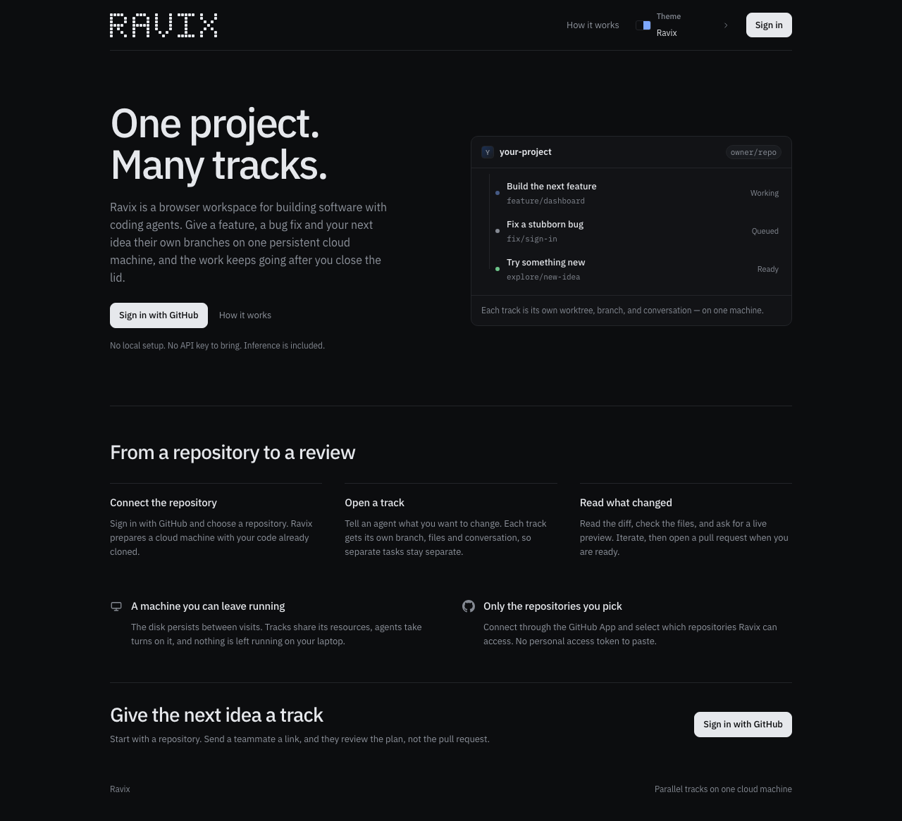
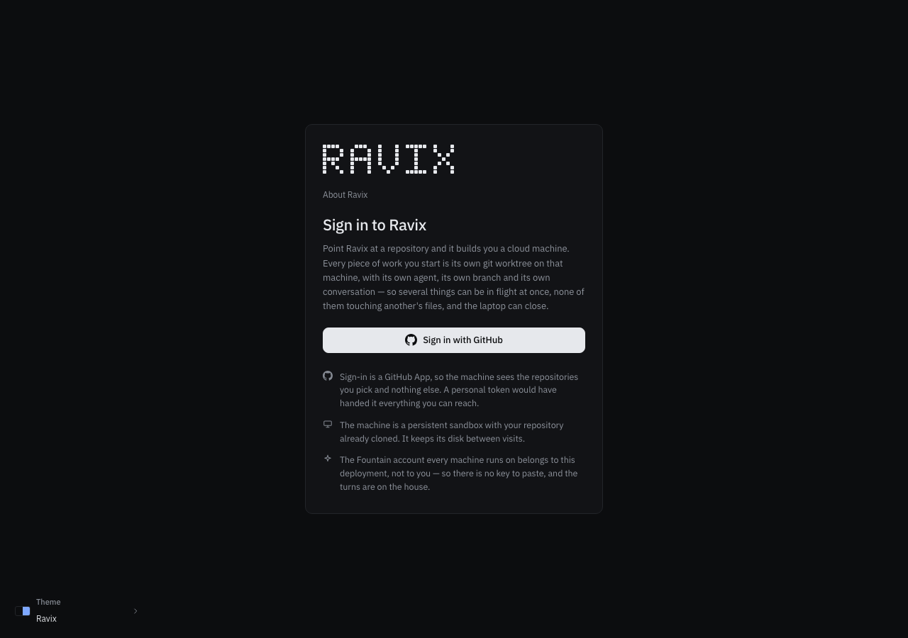
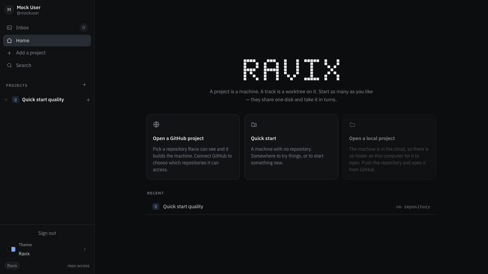
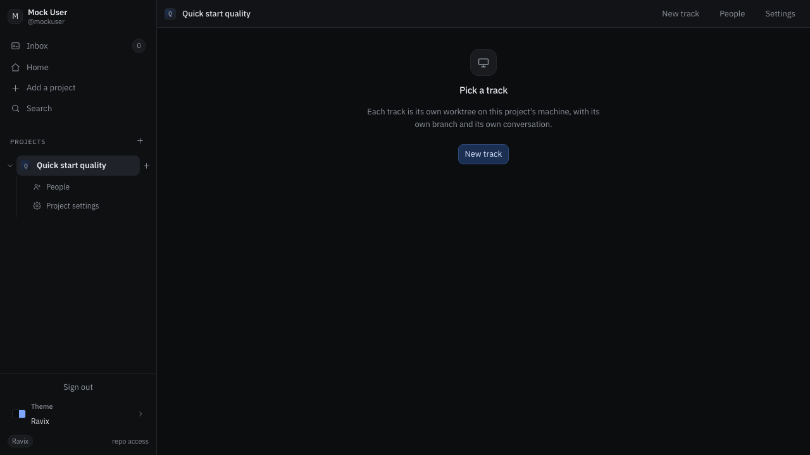
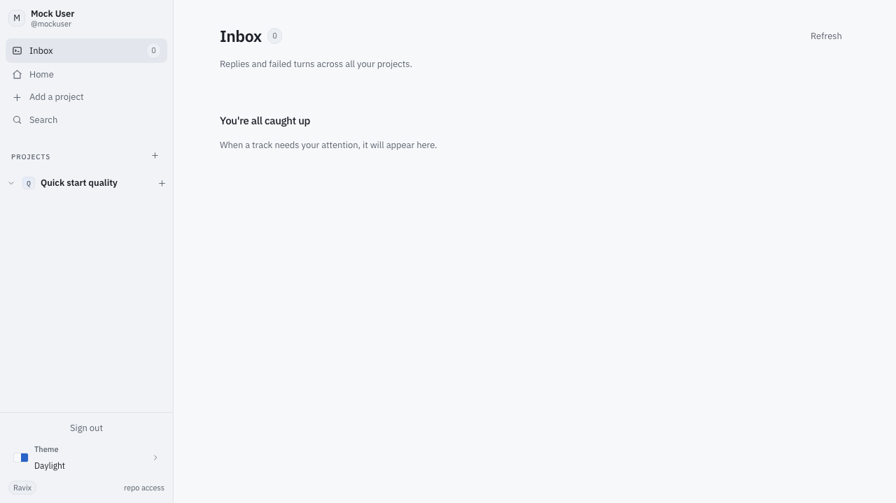
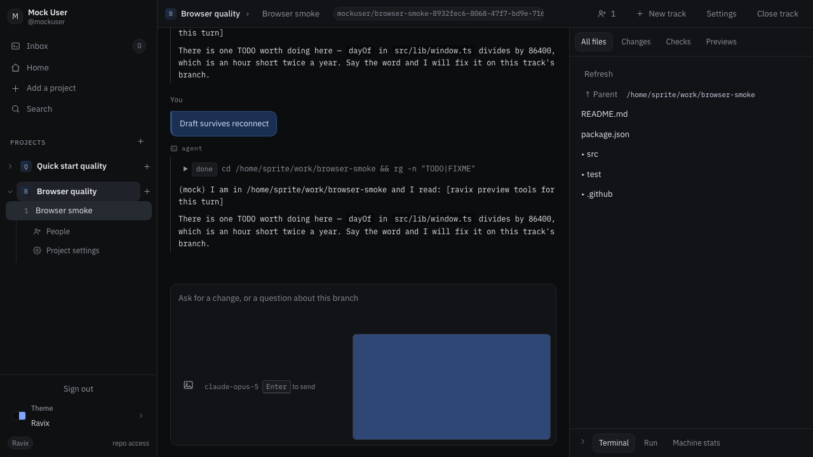
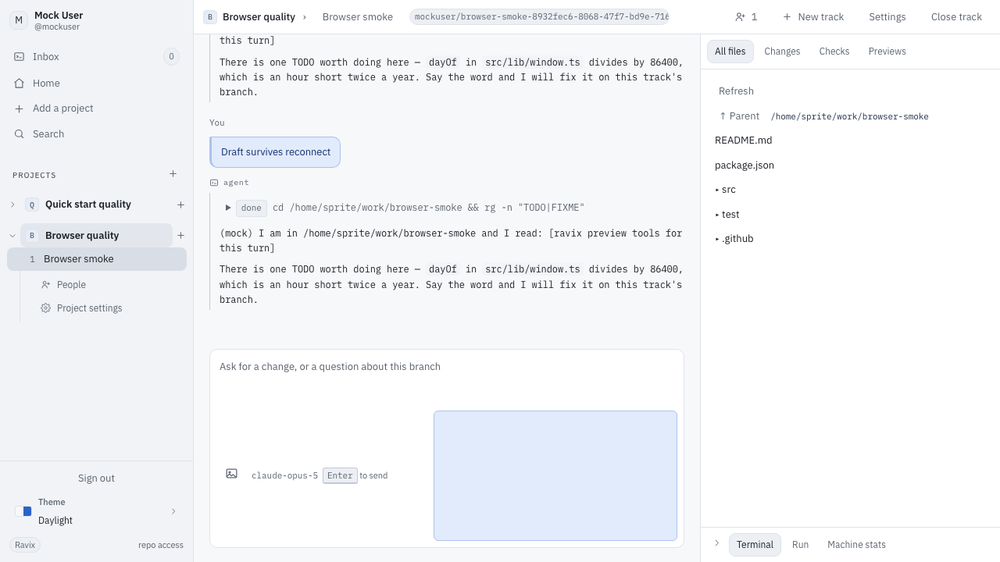
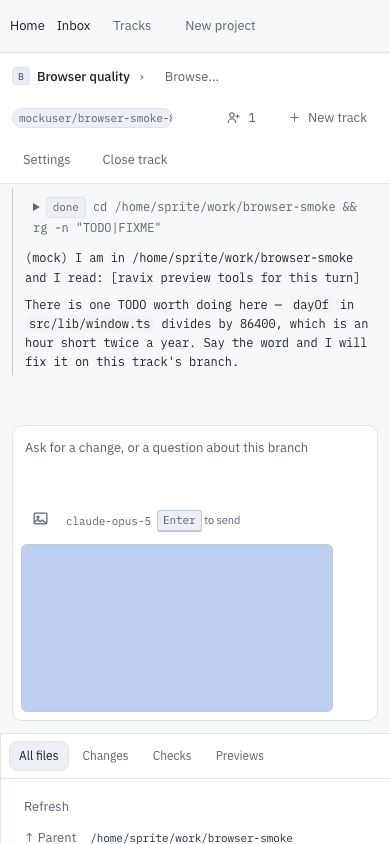
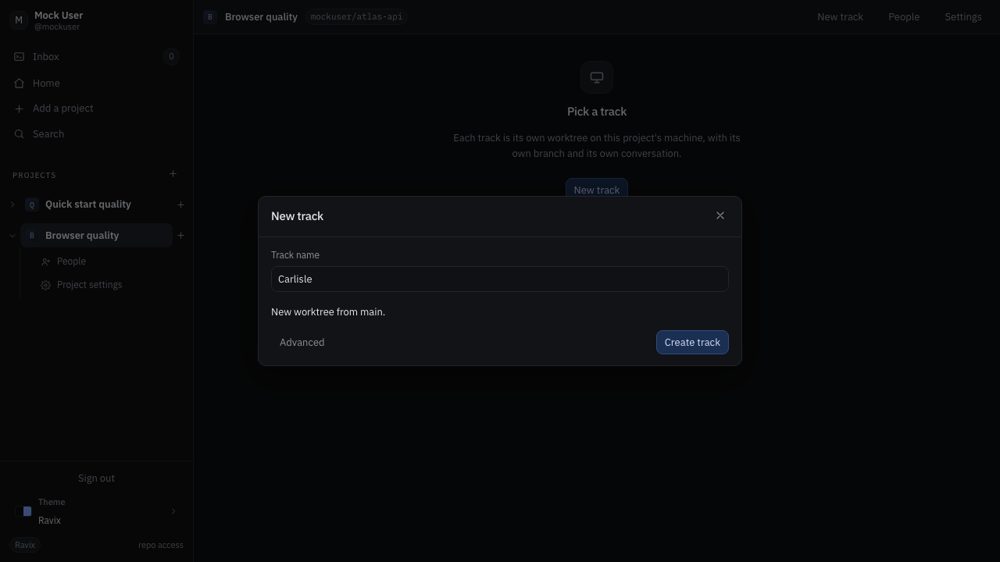
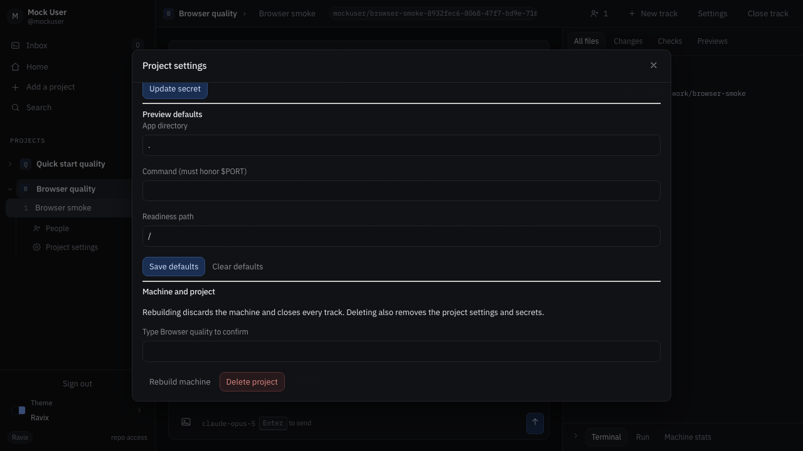

# UI continuity for the Elixir rollout

The LiveView workspace follows the deployed
[Switchyard demo](https://switchyard.demo.managoat.com/), inspected alongside
the production Elixir build in Chrome on September 9, 2026. The rollout retains
the familiar blue-gray palette, rounded controls, three home cards, recent rows,
collapsible project rail, inbox cards, and transcript/composer proportions.

A selected track has one header, with project settings and track creation in the
same place as the demo. Human messages appear in left-aligned bubbles and agent
output has a monospace gutter. The machine dock collapses without losing an
unfinished command. New tracks receive a suggested name, with origin selection
under Advanced. Long settings dialogs scroll beneath a fixed heading and close
button; opening these dialogs preserves the composer draft and returns focus.

[PR #14](https://github.com/ravix-hq/ravix/pull/14), commit
`794a172e5cf4e8aef304d6666ea010dcf791f1ef`, by Raunak Singwi, supplied the
self-hosted IBM Plex fonts, landing/sign-in styling, and component refinements.
The deployed app's palette and card layout take precedence over its brass
palette and stacked home actions for this rollout. Fonts include their SIL
license, and muted text remains adjusted for contrast in Ravix and Daylight.

The app retains Ravix branding and Plex typography. This is visual continuity,
not pixel equality: provider data and some controls differ. Setup remains in
project settings, while the machine dock exposes Terminal, Run, and Machine
stats. Local-project support remains disabled with an explanation. Permissions,
streaming, uploads, and previews use the Elixir implementation.

## Review captures

These are production-build captures against disposable local mock providers.
No reference account's project names or conversations are included. Desktop
captures are 1280 pixels wide; mobile is 390 pixels. They are review artifacts,
not pixel-equality test baselines.

| Landing | Sign-in |
|---|---|
|  |  |

| Home | Project |
|---|---|
|  |  |

| Inbox in Daylight | Track |
|---|---|
|  |  |

| Track in Daylight | Mobile track |
|---|---|
|  |  |

| New track | Settings scrolled to the last controls |
|---|---|
|  |  |

## Verification

Four Chromium flows cover public pages at 1280/820/390 pixels, sign-in at
1280/390, both palettes, all eight local font faces, saved themes, scratch
projects and recent navigation, project disclosure, advanced track options,
keyboard/dialog focus, streamed replies, actual image selection/submission,
reconnect draft retention, and session revocation. Dock changes preserve the
terminal draft; parent dialogs opened from a nested track preserve the composer.
Axe reports no violations on the checked Ravix and Daylight pages. The full
screenshot matrix and failure traces are retained in browser CI artifacts.

`mix precommit` passes 719 tests and four generated properties, with 92.12%
production coverage, plus 27 DOM/guard tests and the static/release gates.
Docker smoke verifies release boot, fonts/assets, repeatable migrations, and
preservation of legacy tables. Chrome comparison also covered populated home,
project, inbox, track, and new-track views.
